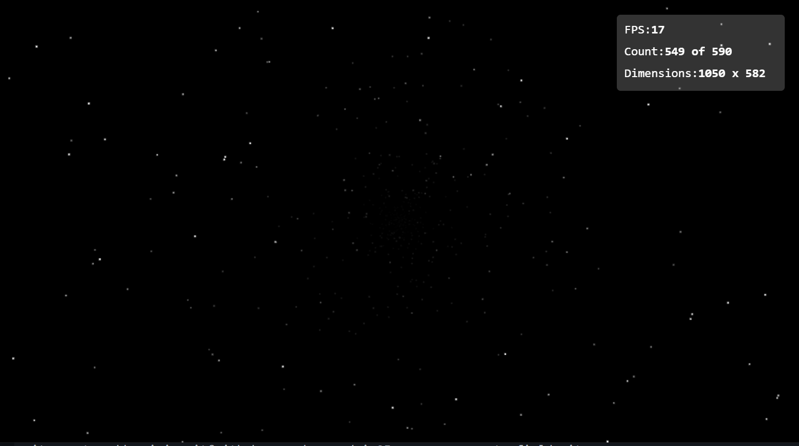

# Starfield Simulator



## Overview

A classic Windows 95 starfield simutlator screen saver written in TypeScript.  Uses HTML5 Canvas.

## Usage

- Use `d` on your keyboard to toggle the debug window
- Use the `UP` and `DOWN` arrows to change the number of stars
- Use the `RIGHT` and `LEFT` arrows to speed up or slow down the simulator
- Use the `SPACE` key to pause or unpause the simuator

## Build

Building requires `yarn` or `npm`:

```sh
$ yarn install  // or npm install
$ yarn start // or npm start
```
